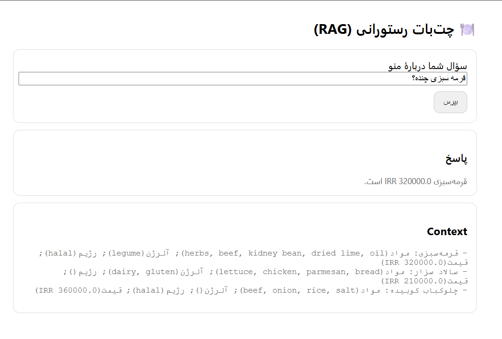

# Restaurant RAG Bot (Public)

A compact **RAG** demo for restaurant menus: Hybrid Retrieval (**FAISS + BM25**) + **OpenAI Chat**.
Minimal HTML UI (no Gradio), FastAPI backend, and a tiny sample menu (Persian).



---

## Features
- 🔎 **Hybrid Retrieval:** FAISS (vector) + BM25 (lexical)
- 🧠 **RAG Chain:** System prompt enforces "answer only from context"
- 🤖 **OpenAI Chat:** `gpt-4o-mini` by default (configurable)
- ⚙️ **Switchable embeddings:** OpenAI or HuggingFace
- 🖥️ **Simple HTML UI:** open `ui/ui.html` directly in your browser
- 🚀 **FastAPI** endpoint: `POST /ask`

---

## Quickstart (Windows / macOS / Linux)

### 1) Clone + Setup
```bash
git clone <your-repo-url>.git
cd restaurant-bot-public
python -m venv .venv
# Windows:
.\.venv\Scripts\Activate.ps1
# macOS/Linux:
# source .venv/bin/activate

python -m pip install --upgrade pip
pip install -r requirements.txt
```

### 2) Configure
Copy the example env and set your OpenAI API key:
```bash
# Windows PowerShell
copy .env.example .env
notepad .env

# macOS/Linux
cp .env.example .env
nano .env
```
Update at least:
```env
EMBEDDINGS_PROVIDER=openai
OPENAI_API_KEY=sk-xxxxxxxxxxxxxxxxxxxxxxxx
OPENAI_EMBED_MODEL=text-embedding-3-small
OPENAI_CHAT_MODEL=gpt-4o-mini
```

### 3) Prepare Sample Data
```bash
python app/ingest/normalize_menu.py
```

### 4) Run the API
```bash
uvicorn app.api.main:app --host 0.0.0.0 --port 8000 --reload
```

### 5) Open the HTML UI
Open `ui/ui.html` in your browser.
Type a question in Persian (e.g., "غذای بدون گلوتن دارید؟") and click **Ask**.

---

## Endpoint
- `POST /ask`
  - Request JSON: `{ "query": "<your question>" }`
  - Response JSON: `{ "answer": "...", "context": "..." }`

Example (PowerShell):
```powershell
curl -Method POST -Uri http://localhost:8000/ask -Body '{"query":"قیمت کوبیده چنده؟"}' -ContentType "application/json"
```

---

## Folder Structure
```text
app/
  api/                # FastAPI
  core/               # config (dotenv)
  ingest/             # normalization script
  rag/                # embeddings, FAISS, retriever, chain
  data/               # sample & processed data
ui/
  ui.html             # simple browser UI
docs/
  screenshot.png      # place your screenshot here
```

---

## Screenshot
- Run the API, open `ui/ui.html`, type a query, and take a screenshot.
- Save it to `docs/screenshot.png` so it shows up in the README banner.

---

## Tips
- If you change the menu, delete `.vectordb/faiss` so FAISS rebuilds on the next query.
- To avoid OpenAI usage, switch to HF embeddings in `.env`:
  ```env
  EMBEDDINGS_PROVIDER=hf
  HF_MODEL=intfloat/multilingual-e5-small
  ```
  (Chat still uses OpenAI unless you swap it out in `app/rag/chain.py`.)

---

## License
MIT
